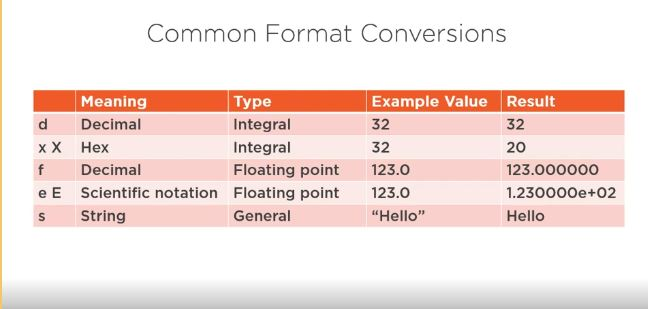
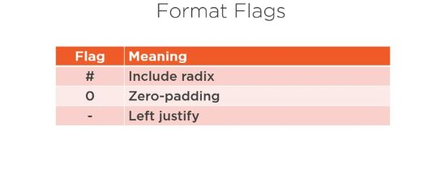
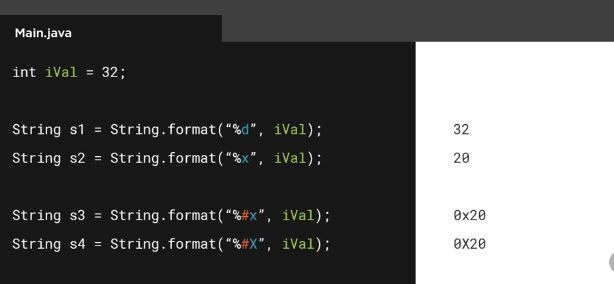
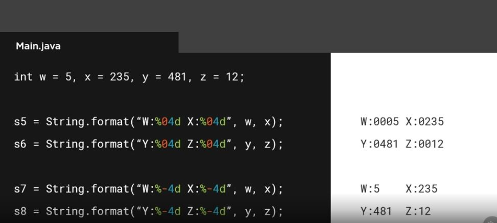

# Strings and its methods and why immutable

1. string variables never directly holds the string value
2. string variables holds a reference to the instance of string
3. any change in value creates a new instance of the string 

# string equality // equals()

String s1,s2;
when we do s1==s2 then we are actually checking if s1 and s2 both string variables reference the same string instance

to check for equality of two strings 
s1.equals(s2) this is character by character checking

new methods intern()

s3 = s1.intern();
s4 = s2.intern();

s3 and s4 point to same allocated string 
so now s3 == s4 can be checked

            operation           |          methods
------------------------------- | ----------------------------------------------------------

length                          |          length

create new string from          |         concat,replace,toLowerCase,toUpperCase,trim,split
existing one

extract string                  |        charAt,substring

test substring                  |       contains,endsWith,startsWith,indexOf,lastIndexOf

comparison                      |      equals,equalsIgnore,isEmpty,compareTo,compareToIgnoreCase

formatting                      |     format

string from non string type     |    valueOf

# string builder class

StringBuilder sb = new StringBuilder(40);

sb.append(" string literal");
sb.append(<string variables>);
sb.append(<integer value/variables>);

String message = sb.toString();
 
 //stringbuilder methods
sb.indexOf(" on");
sb.insert(pos," at");
String time  = "9:00am";
sb.insert(pos+4, time);

# string formatting 
int age =11;

string s1 = String.format("hello my age is %d years",age);

double num = 3.55555555555d
string s2 = String.format("the number is %.1f years",num);
//result in 3.5

conversions

# format specifiers

**%[*argument index*][*flags*][*width*][*precision*]conversion**

# flag chart

examples

